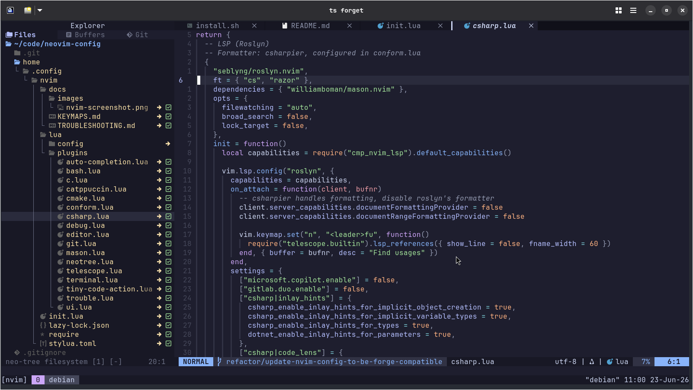

# forge-nvim

Personal Neovim config. Modular by design — each language gets its own file, nothing is tangled together.  
Part of the [forge](https://github.com/clintonbampoe/forge) ecosystem.

 

## Structure

```
home/.config/nvim/
  init.lua                  # editor options, global keymaps, LSP attach, diagnostics
  lua/
    config/
      lazy.lua              # lazy.nvim bootstrap (don't touch this)
    plugins/
      ui.lua                # catppuccin, lualine, bufferline, indent guides
      editor.lua            # autopairs, autosave, vim-matchup, treesitter
      completion.lua        # nvim-cmp + luasnip
      telescope.lua         # fuzzy finder
      neo-tree.lua          # file explorer
      git.lua               # gitsigns, lazygit
      terminal.lua          # toggleterm
      trouble.lua           # diagnostics list
      mason.lua             # tool installer
      conform.lua           # formatters
      debug.lua             # DAP core + UI + keymaps
      tiny-code-action.lua  # code actions picker
      bash.lua              # bash LSP + shellcheck
      c.lua                 # clangd + clangd_extensions + codelldb
      cmake.lua             # cmake LSP
      csharp.lua            # roslyn LSP + netcoredbg
  docs/
    KEYMAPS.md
    TROUBLESHOOTING.md
install.sh                  # installs all system dependencies
```

## Setup

If you're already using forge:
```bash
# pull the latest changes from git
# add to configs.conf in your local forge repo, then run forge
nvim|https://github.com/clintonbampoe/forge-nvim.git|forge-nvim
```

Manual setup:
```bash
git clone https://github.com/clintonbampoe/forge-nvim.git
cd forge-nvim
./install.sh
stow --dir=. --target=$HOME home
```

Then open Neovim and run `:Lazy sync`. Mason installs LSP servers and formatters automatically on first launch.

## Adding a language

1. Create `home/.config/nvim/lua/plugins/<language>.lua`
2. Put the LSP config, formatter, DAP adapter, and language keymaps all in that one file
3. Add any tools to `ensure_installed` in `mason.lua`
4. Add the formatter to `formatters_by_ft` in `conform.lua`
5. That's it — lazy.nvim picks it up automatically

See `home/.config/nvim/docs/KEYMAPS.md` for all keybindings.
See `home/.config/nvim/docs/TROUBLESHOOTING.md` for common issues.
