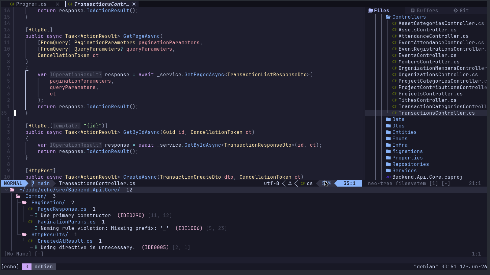

# neovim-config

My modular Neovim configuration written **FROM SCRATCH** in Lua, using [lazy.nvim](https://github.com/folke/lazy.nvim) for plugin management.  
Optimized for C# and C/C++ development with LSP, debugging, git integration, and a clean UI.



## Requirements

**Neovim 0.11 or higher is required.**

> ⚠️ Do not use Neovim 0.10. nvim-treesitter will not work correctly — you will get parser errors or silent failures. Upgrade to 0.11+ before proceeding.

Check your version:

```bash
nvim --version
```

Upgrade on Ubuntu/Debian:

```bash
sudo apt remove neovim
sudo snap install nvim --classic
# or download the latest AppImage from https://github.com/neovim/neovim/releases
```

Other required tools:

- `git`
- `gcc` or `clang` — required by nvim-treesitter to compile parsers, and for C development
- `make` — required by telescope-fzf-native to build its native sorter
- `npm` / `node` — required by Mason to install some LSP servers
- `ripgrep` — required by Telescope live_grep (`sudo apt install ripgrep`)
- `lazygit` — required for the lazygit.nvim plugin ([install guide](https://github.com/jesseduffield/lazygit#installation))
- A [Nerd Font](https://www.nerdfonts.com/) installed and set as your terminal font — required for icons in neo-tree, lualine, and devicons

---

## Installation

### 1. Back up your existing config (if any)

```bash
mv ~/.config/nvim ~/.config/nvim.bak
mv ~/.local/share/nvim ~/.local/share/nvim.bak
mv ~/.local/state/nvim ~/.local/state/nvim.bak
mv ~/.cache/nvim ~/.cache/nvim.bak
```

### 2. Clone this repo

```bash
git clone https://github.com/clintonbampoe/neovim-config.git ~/.config/nvim
```

### 3. Open Neovim

```bash
nvim
```

lazy.nvim bootstraps itself and installs all plugins automatically. Wait for the progress UI to finish, then restart Neovim.

> On first launch you may see warnings about missing parsers or LSP servers — these resolve after the install completes and you restart.

### 4. Install language servers via Mason

```
:Mason
```

Tools auto-installed by this config: `clangd`, `codelldb`, `clang-format`. For C#, also install `csharpier` from the Mason UI.

---

## Languages

### C / C++

- Language server: `clangd` (auto-installed via Mason)
- Formatter: `clang-format` (auto-installed via Mason)
- Debugger: `codelldb` (auto-installed via Mason)
- Inlay hints: parameter names and inferred types shown inline

For best results, generate a `compile_commands.json` in your project root:

```bash
# With CMake
cmake -B build -DCMAKE_EXPORT_COMPILE_COMMANDS=ON
ln -s build/compile_commands.json .

# Without CMake (requires bear)
bear -- make
```

Also add a `.clangd` file to anchor the LSP root:

```bash
touch .clangd
```

### C#

- Language server: Roslyn (`seblyng/roslyn.nvim`) — requires the .NET SDK installed at system level
- Formatter: `csharpier` via conform.nvim (install via `:MasonInstall csharpier`)
- Formatting is disabled on the LSP side and handled entirely by csharpier

```bash
# Install .NET SDK (Ubuntu/Debian)
sudo apt install dotnet-sdk
```

---

## Structure

```
~/.config/nvim/
├── init.lua                       -- entry point: options, keymaps, autocmds
├── lazy-lock.json                 -- locked plugin versions (do not delete)
└── lua/
    ├── config/
    │   └── lazy.lua               -- lazy.nvim bootstrap and setup
    └── plugins/
        ├── autopairs.lua          -- auto-close brackets and quotes
        ├── autosave.lua           -- automatic file saving
        ├── catppuccin.lua         -- colorscheme (Mocha)
        ├── clangd.lua             -- C/C++ language server config
        ├── clangd_extensions.lua  -- inlay hints and AST view for C/C++
        ├── cmp.lua                -- autocompletion engine
        ├── conform.lua            -- format on save
        ├── dap.lua                -- debugger core + keymaps
        ├── dap-ui.lua             -- debugger UI panels
        ├── gitsigns.lua           -- git change indicators in gutter
        ├── indent-blankline.lua   -- indent guides
        ├── lazygit.lua            -- lazygit integration
        ├── lsp.lua                -- LSP client base config
        ├── lualine.lua            -- statusline
        ├── mason.lua              -- LSP and tool installer
        ├── neo-tree.lua           -- file explorer
        ├── roslyn.lua             -- C# language server
        ├── telescope.lua          -- fuzzy finder
        ├── tiny-code-action.lua   -- code action picker via Telescope
        ├── toggleterm.lua         -- floating terminal
        ├── treesitter.lua         -- syntax parsing and highlighting
        └── trouble.lua            -- diagnostics list panel
```

---

## Plugin overview

| Plugin                   | Purpose                                       |
| ------------------------ | --------------------------------------------- |
| `lazy.nvim`              | Plugin manager                                |
| `catppuccin`             | Colorscheme (Mocha flavour)                   |
| `nvim-lspconfig`         | LSP client configuration                      |
| `mason.nvim`             | LSP and tool installer                        |
| `clangd_extensions.nvim` | Extra clangd features (inlay hints, AST view) |
| `roslyn.nvim`            | C# language server                            |
| `nvim-cmp` + `LuaSnip`   | Autocompletion and snippets                   |
| `friendly-snippets`      | VSCode-style snippet collection               |
| `conform.nvim`           | Format on save                                |
| `nvim-dap`               | Debug adapter protocol client                 |
| `nvim-dap-ui`            | Debugger UI panels                            |
| `nvim-treesitter`        | Syntax parsing, better highlighting           |
| `telescope.nvim`         | Fuzzy finder                                  |
| `neo-tree.nvim`          | File explorer                                 |
| `lualine.nvim`           | Statusline                                    |
| `gitsigns.nvim`          | Git hunk indicators in gutter                 |
| `lazygit.nvim`           | LazyGit terminal UI                           |
| `toggleterm.nvim`        | Floating terminal                             |
| `trouble.nvim`           | Diagnostics list panel                        |
| `indent-blankline.nvim`  | Indent guides                                 |
| `nvim-autopairs`         | Auto-close brackets and quotes                |
| `auto-save.nvim`         | Automatic file saving                         |
| `tiny-code-action.nvim`  | Code action picker via Telescope              |

---

## Plugin management

```
:Lazy          -- open plugin manager UI
:Lazy update   -- update all plugins
:Lazy sync     -- install missing + update + remove unused
:Lazy clean    -- remove unused plugins only
:Lazy log      -- view install/load logs
```

---

## Docs

- [KEYMAPS.md](./KEYMAPS.md) — all key bindings
- [TROUBLESHOOTING.md](./TROUBLESHOOTING.md) — common issues and fixes
